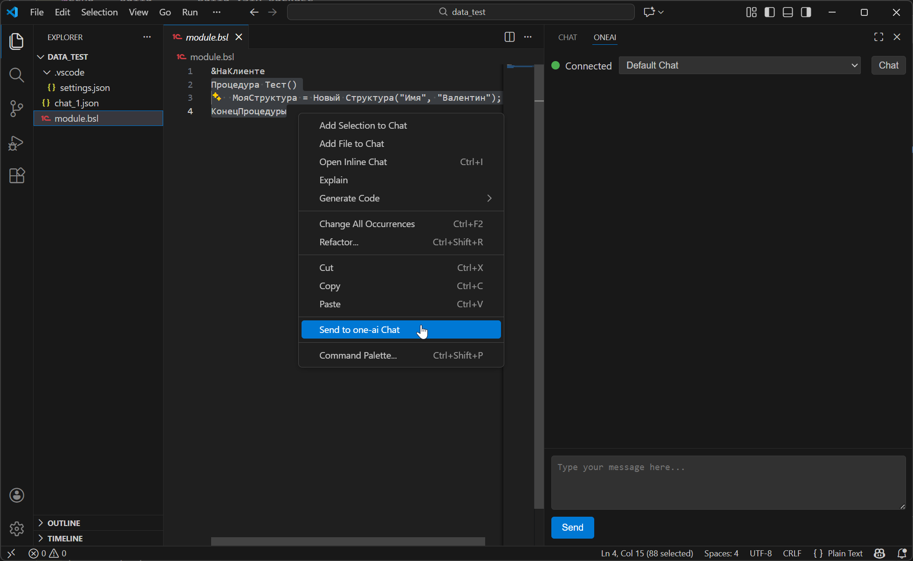
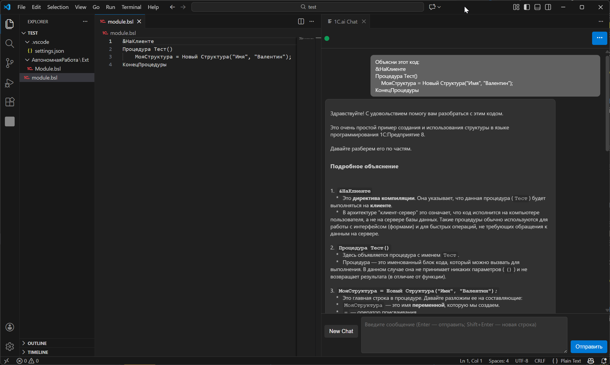

# 1C.ai Assistant

Расширение vscode-ai-frend. Чат с напарником от 1с.

## Требования к настройке (settings.json)

Для корректной работы расширения необходимо настроить файл `settings.json` вашего рабочего пространства (`.vscode/settings.json`). Ниже приведены доступные параметры:

* `one-ai.autoConnect`: (boolean, по умолчанию `true`) Автоматически подключаться к 1C.ai при открытии панели чата.
* `one-ai.token`: (string) Токен API для подключения к 1C.ai. **Обязательный параметр.**
* `one-ai.base_url`: (string, по умолчанию `https://code.1c.ai`) Базовый URL для API 1C.ai.
* `one-ai.timeout`: (number, по умолчанию `30`) Таймаут для API-запросов в секундах.

## Возможности

Создание нового чата, сохранение и восстановление истории чатов. Управление списком чатов. Вставка текста (кода) в чат через контекстное меню окна редактора.

## Токен доступа

Для связи с напарником необходимо получить токен доступа на `https://code.1c.ai/`.
